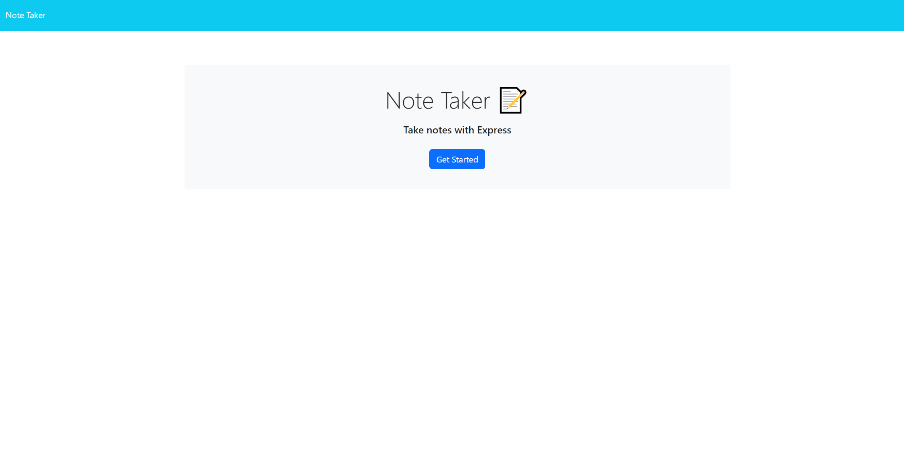
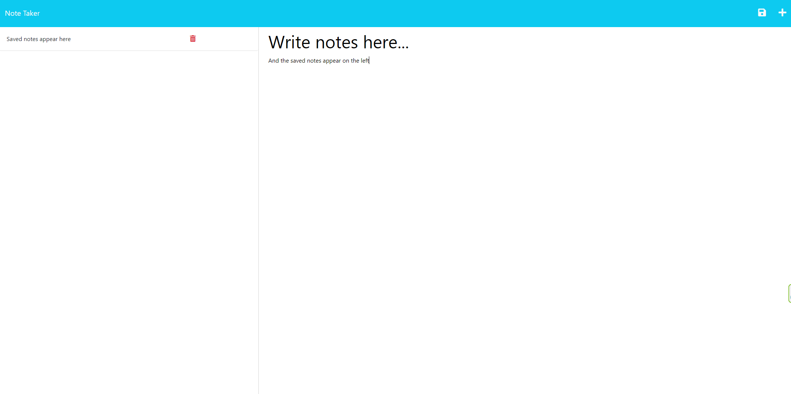

  
  # ReadmeGenerator

  ## Table Of Contents
  * [Description](#description)
  * [Installation](#installation)
  * [Usage](#usage)
  * [License](#license)
  * [Contributing](#contributing)
  * [Tests](#tests)
  * [Questions](#questions)

  ## Description 
  This program lets users create, delete, and store notes. Notes are saved and retrieved using a backend with express. This app was deployed to Heroku.

  ## Installation
  N/A

  ## Usage
  Once on the landing page, click "Get Started" to navigate to the note creator.
    * To create a new note, enter use the right side to enter a note title and note text. If both fields are populated, a save button in the top right of the page will appear. Click this to save your note.
    * Saved notes will appear on the left hand side of the page. Click them to view them, or click the trash can to delete them.
    * If you are viewing a note, you can click the + symbol on the top left of the page to begin writing a new note.

  ## License
  MIT
  Copyright (c) 2023 Michael Lee and others

    Permission is hereby granted, free of charge, to any person obtaining
    a copy of this software and associated documentation files (the
    "Software"), to deal in the Software without restriction, including
    without limitation the rights to use, copy, modify, merge, publish,
    distribute, sublicense, and/or sell copies of the Software, and to
    permit persons to whom the Software is furnished to do so, subject to
    the following conditions:
    
    The above copyright notice and this permission notice shall be
    included in all copies or substantial portions of the Software.
    
    THE SOFTWARE IS PROVIDED "AS IS", WITHOUT WARRANTY OF ANY KIND,
    EXPRESS OR IMPLIED, INCLUDING BUT NOT LIMITED TO THE WARRANTIES OF
    MERCHANTABILITY, FITNESS FOR A PARTICULAR PURPOSE AND
    NONINFRINGEMENT. IN NO EVENT SHALL THE AUTHORS OR COPYRIGHT HOLDERS BE
    LIABLE FOR ANY CLAIM, DAMAGES OR OTHER LIABILITY, WHETHER IN AN ACTION
    OF CONTRACT, TORT OR OTHERWISE, ARISING FROM, OUT OF OR IN CONNECTION
    WITH THE SOFTWARE OR THE USE OR OTHER DEALINGS IN THE SOFTWARE.

  ## Contributing
  Michael Lee

  ## Tests
  N/A

  ## Questions
  Please send any questions to leex3683@umn.edu
  Find my GitHub [here](https://github.com/leex3683)
